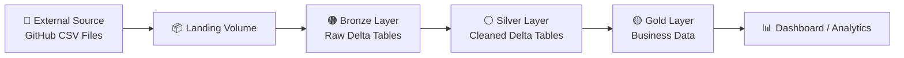

# 📊 Read CSV Data – Data Engineering Project


🚀 This repository contains a **Data Engineering practice project** that demonstrates how to ingest and process **CSV data from an external source** using the **Medallion Architecture (Bronze → Silver → Gold)** on **Databricks**.

The project simulates an **external system using a GitHub folder** and builds a pipeline to ingest, transform, and prepare data for analytics.

---

# 🏗️ Architecture

This project follows the **Medallion Architecture**, a common pattern in modern data engineering.

🟤 **Bronze** → Raw data ingestion  
⚪ **Silver** → Cleaned and standardized data  
🟡 **Gold** → Business-ready datasets for analytics  

---

## 🧭 Medallion Architecture Diagram



---

# ⚙️ Data Pipeline Workflow

```mermaid
flowchart TD

A[📁 External CSV Data] --> B[📥 External Extract Notebook]

B --> C[📦 Landing Volume]

C --> D[🟤 Bronze Load Notebook]
D --> E[🟤 Bronze Delta Tables]

E --> F[⚪ Silver Transform Notebooks(WIP)]
F --> G[⚪ Silver Delta Tables(WIP)]

G --> H[🟡 Gold Transform Notebook(Planned)]
H --> I[🟡 Gold Tables(Planned)]

I --> J[📊 Analytics / Dashboard(Planned)]
```

---

# 🧰 Technologies Used

| Technology | Purpose |
|------------|--------|
| 🔴 Databricks | Data engineering platform |
| 🟠 PySpark | Distributed data processing |
| 🔵 Delta Lake | Lakehouse storage format |
| ⚫ GitHub | External data source simulation |

---

# 📁 Project Structure

```
project
│
├── configs
│   ├── bronze_config.py
│   ├── initial_config.py
│   └── silver_config.py
│
├── dataset
│   └── source
│       ├── source_crm
│       │   ├── cust_info.csv
│       │   ├── prd_info.csv
│       │   └── sales_details.csv
│       │
│       └── source_erp
│           ├── CUST_AZ12.csv
│           ├── LOC_A101.csv
│           └── PX_CAT_G1V2.csv
│
├── scripts
│   ├── 0_initial_script
│   │   └── initial_setup.ipynb
│   │
│   ├── 1_external_extract
│   │   └── external_extract.ipynb
│   │
│   ├── 2_bronze_script
│   │   └── bronze_load.ipynb
│   │
│   ├── 3_silver_script
│   │   ├── silver_cust_info_transform.ipynb
│   │   ├── silver_prd_info_transform.ipynb (🚧 WIP)
│   │   ├── silver_sales_details_transform.ipynb (🚧 WIP)
│   │   ├── silver_CUST_AZ12_transform.ipynb (🚧 WIP)
│   │   ├── silver_LOC_A101_transform.ipynb (🚧 WIP)
│   │   └── silver_PX_CAT_G1V2_transform.ipynb (🚧 WIP)
│   │
│   ├── 4_gold_script
│   │   └── gold_transform.ipynb (📝 Planned)
│   │
│   └── etc
│       └── drop_readcsvdata_project.ipynb (📝 Planned)
│
├── LICENSE
└── README.md
```

---

# 📌 Project Summary

| Step | Description | Status |
|-----|-------------|-------|
| 1 | Create project environment | ✅ Completed |
| 2 | Extract data from external source | ✅ Completed |
| 3 | Load data into Bronze layer | ✅ Completed |
| 4 | Transform data into Silver layer | 🚧 In Progress |
| 5 | Build data pipeline | 📝 Planned |
| 6 | Build analytics dashboard | 📝 Planned |

---

# 🟤 Bronze Layer – Raw Data Ingestion

The Bronze layer stores **raw data exactly as received from the source**.

### Process

- Read CSV files from landing volumes
- Load data into **Bronze Delta tables**
- Move processed files from landing folder to processed folder

### Purpose

✔ Preserve raw data  
✔ Enable traceability  
✔ Support reprocessing if needed  

---

# ⚪ Silver Layer – Data Transformation

*(Work in progress)*

The Silver layer contains **cleaned and standardized data**.

### Transformation Steps

- Remove leading and trailing spaces from string columns
- Normalize specific column values
- Rename columns using standardized naming conventions
- Apply basic data quality validation

---

# 🔍 Data Quality Checks

*(Work in progress)*

Validation checks include:

- Trim validation for string columns
- Column normalization validation
- Schema consistency checks

---

# 🔄 Data Pipeline (Planned)

Pipeline stages:

1️⃣ Extract data from external source  
2️⃣ Load raw data to Bronze tables  
3️⃣ Transform data into Silver tables  
4️⃣ Run data quality validation  

---

# 🚀 Future Improvements

- Implement **Gold layer analytics tables**
- Add **Databricks Workflows orchestration**
- Implement **automated data quality checks**
- Add **monitoring and logging**
- Build **Databricks dashboards**

---

# 🎯 Purpose of This Project

This project is designed to practice **core Data Engineering concepts**:

- Data ingestion
- Medallion architecture
- Data transformation with PySpark
- Delta Lake management
- Data pipeline design

---

# 👨‍💻 Author

**Kevin**  
Data Engineering Practice Project