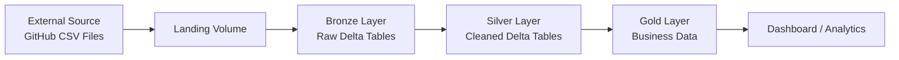
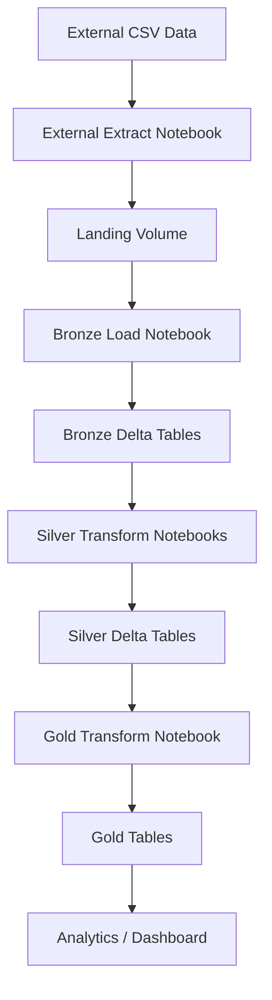

# Read CSV Data – Data Engineering Project


This repository contains a **Data Engineering practice project** that demonstrates how to ingest and process CSV data from an external source using the **Medallion Architecture (Bronze → Silver → Gold)** on **Databricks**.

The project simulates an external system using a **GitHub folder as the data source** and builds a pipeline to ingest, transform, and prepare data for analytics.

---

# Architecture

This project follows the **Medallion Architecture**, a widely used pattern in modern data engineering.

**Bronze** → Raw data ingestion  
**Silver** → Cleaned and standardized data  
**Gold** → Business-ready datasets for analytics  

---

## Medallion Architecture



---

# Data Pipeline Workflow



---

# Technologies Used

- Databricks Platform
- Apache Spark / PySpark
- Delta Lake
- GitHub (simulated external data source)

---

# Project Structure

```
project
│
├── configs
│   ├── bronze_config.py
│   ├── initial_config.py
│   └── silver_config.py
│
├── dataset
│   └── source
│       ├── source_crm
│       │   ├── cust_info.csv
│       │   ├── prd_info.csv
│       │   └── sales_details.csv
│       │
│       └── source_erp
│           ├── CUST_AZ12.csv
│           ├── LOC_A101.csv
│           └── PX_CAT_G1V2.csv
│
├── scripts
│   ├── 0_initial_script
│   │   └── initial_setup.ipynb
│   │
│   ├── 1_external_extract
│   │   └── external_extract.ipynb
│   │
│   ├── 2_bronze_script
│   │   └── bronze_load.ipynb
│   │
│   ├── 3_silver_script
│   │   ├── silver_cust_info_transform.ipynb
│   │   ├── silver_prd_info_transform.ipynb (WIP)
│   │   ├── silver_sales_details_transform.ipynb (WIP)
│   │   ├── silver_CUST_AZ12_transform.ipynb (WIP)
│   │   ├── silver_LOC_A101_transform.ipynb (WIP)
│   │   └── silver_PX_CAT_G1V2_transform.ipynb (WIP)
│   │
│   ├── 4_gold_script
│   │   └── gold_transform.ipynb (Planned)
│   │
│   └── etc
│       └── drop_readcsvdata_project.ipynb (Planned)
│
├── LICENSE
└── README.md
```

---

# Project Summary

1. Create project environment  
2. Extract data from external source  
3. Load data into Bronze layer  
4. Transform and clean data into Silver layer *(Work in progress)*  
5. Build data pipeline *(Planned)*  
6. Prepare data for analytics and dashboards *(Planned)*  

---

# Project Details

## 1. Environment Setup

The project environment is created using a setup script.

**Catalog**

```
readcsvdata
```

**Schemas**

- bronze
- silver
- gold

**Volumes**

Landing volumes
- landing_source_crm
- landing_source_erp

Processed volumes
- process_source_crm
- process_source_erp

---

## 2. Data Extraction

Raw CSV data is ingested from the external source into the landing volumes.

### CRM Source Files

- cust_info.csv  
- prd_info.csv  
- sales_details.csv  

### ERP Source Files

- CUST_AZ12.csv  
- LOG_A101.csv  
- PX_CAT_G1V2.csv  

---

## 3. Bronze Layer – Raw Data Ingestion

The Bronze layer stores raw data exactly as received from the source.

Process:

- Read CSV files from landing volumes
- Load data into Bronze Delta tables
- Move processed files from landing folder to processed folder

Purpose:

- Preserve raw data
- Enable traceability and reprocessing

---

## 4. Silver Layer – Data Transformation *(Work in progress)*

The Silver layer contains cleaned and standardized data.

Transformation steps:

- Remove leading and trailing spaces from string columns
- Normalize specific column values
- Rename columns using standardized naming conventions
- Apply basic data quality validation

The cleaned data is written into **Silver Delta tables**.

---

## 5. Data Quality Checks *(Work in progress)*

Basic validation ensures data integrity:

- Trim validation for string columns
- Column normalization validation
- Schema consistency checks

---

## 6. Data Pipeline *(Planned)*

A pipeline will orchestrate the ingestion and transformation processes.

Pipeline stages:

1. Extract data from external source  
2. Load raw data to Bronze tables  
3. Transform data into Silver tables  
4. Perform data quality checks  

---

# Future Improvements

Planned enhancements:

- Implement the **Gold layer** for business metrics
- Add orchestration using **Databricks Workflows**
- Introduce automated **data quality validation**
- Add **monitoring and logging**
- Build **Databricks dashboards** for analytics

---

# Purpose of This Project

This project is designed as a **hands-on practice for core Data Engineering concepts**, including:

- Data ingestion
- Medallion architecture implementation
- Data transformation using PySpark
- Delta Lake data management
- Data pipeline design

---

# Author

Kevin  
Data Engineering Practice Project